<table border="0" cellspacing="0" cellpadding="0">
  <tr>
    <td valign="middle"></td>
    <td valign="middle"><h1>research-drawio-skill</h1></td>
  </tr>
</table>

**Language:** [中文](README.md) | English

`research-drawio-skill` is a Codex skill suite for creating publication-style
scientific schematics in diagrams.net / draw.io.

The recommended two-stage entry point is `research-draw`: it first creates or
uses a polished raster reference image, then traces that reference into an
editable `.drawio` diagram with `research-drawio-skill`. Use
`research-drawio-skill` directly when you already know the diagram structure or
only need to create, revise, audit, export, or QA a draw.io source file.

The skill is designed for research-paper figures such as method pipelines,
experimental workflows, cohort flow diagrams, mechanism schematics,
multi-omics/data-integration diagrams, model architecture diagrams, and graphical
abstracts. Its design philosophy follows the `nature-figure` style of thinking:
define the scientific message first, build the evidence and topology next,
engineer the layout and connectors, then apply restrained journal-ready visual
style and export QA.

The current version also enforces layout engineering and visual construction:
grid-first alignment, protected formula zones, connector corridors, semantic
composite elements built from draw.io primitives, and a lightweight `.drawio` QA
script that catches common source-level mistakes before visual export.

Recent design rules also prevent three common failure modes: labels covering
glyph primitives, decorative chart glyphs without scientific meaning, and
over-routed connector paths with unnecessary bends.

Two companion skills are included: `research-draw` for image-generation-to-
draw.io tracing, and `add-svg` for supplementing draw.io diagrams with SVG
scientific assets. `add-svg` forces a source choice before every run: collect
multiple online SVG candidates for later user selection, or create restrained
original SVGs when network assets are unsuitable or unavailable.

## What It Helps With

- Editable `.drawio` scientific workflow diagrams
- Two-stage scientific figure creation: generated reference image, then
  editable draw.io tracing
- Nature-style method and experimental design flowcharts
- Computational pipeline and model architecture schematics
- Cohort/study flow diagrams with inclusion and exclusion logic
- Mechanism and graphical abstract diagrams for manuscripts
- SVG/PDF-ready publication exports with QA-oriented guidance

## Examples

### GAN Handwritten Digit Generation

`example/gan-handwritten-digits/gan-handwritten-digits.drawio` demonstrates the
two-stage `research-draw` workflow: create a raster scientific reference image,
redraw it as editable draw.io primitives, export the draw.io preview, then run
strict visual comparison for multiple iterations.

Input used in Codex:

```text
使用$research-draw 帮我绘制一个使用GAN进行手写数字生成的图，科研风格
```

Reference image:

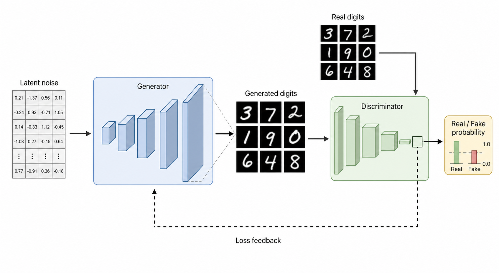

Skill execution flow:

1. `research-draw` established the scientific message, topology, visual
   vocabulary, output contract, and consistency-loop requirement.
2. `imagegen` produced the raster reference image used only as a composition and
   geometry guide.
3. `research-drawio-skill` rebuilt the figure as editable draw.io modules:
   latent-noise table, generator layers, generated and real digit tiles,
   discriminator layers, probability mini-chart, and dashed loss-feedback route.
4. `qa_drawio.py` checked the `.drawio` source. Result:
   `OK XML parsed; vertices=99 edges=16 warnings=0`.
5. `export_drawio_preview.py` exported PNG and SVG previews with draw.io Desktop
   CLI.
6. `compare_drawio_reference.py` ran strict raster comparison for three recorded
   iterations, producing metrics, tile mismatch CSVs, region mismatch CSVs,
   heatmaps, foreground overlays, and side-by-side images.

Final editable output preview:

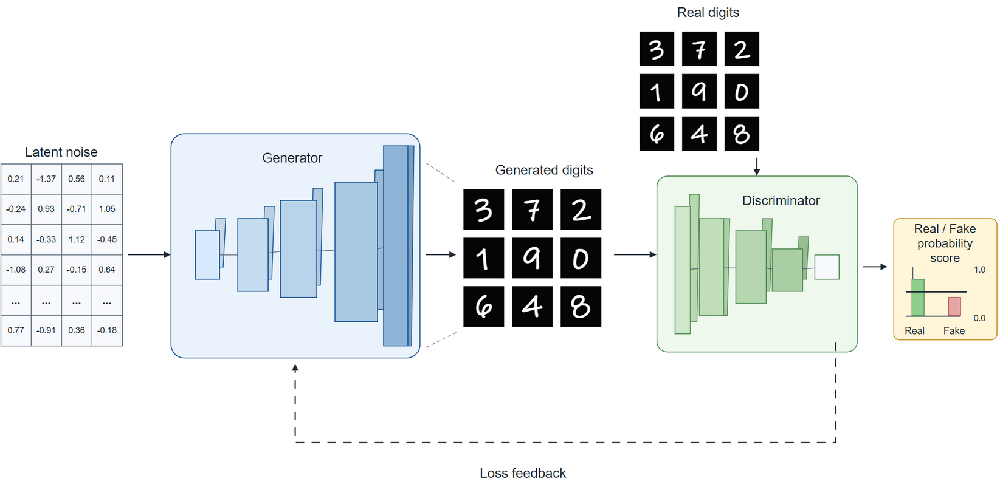

Strict comparison evidence:

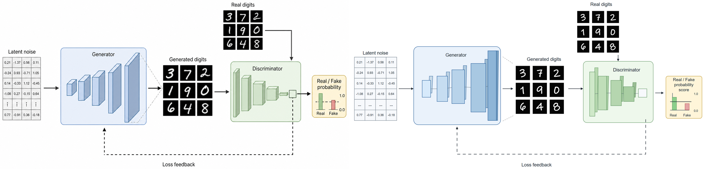

Pixel-difference heatmap:

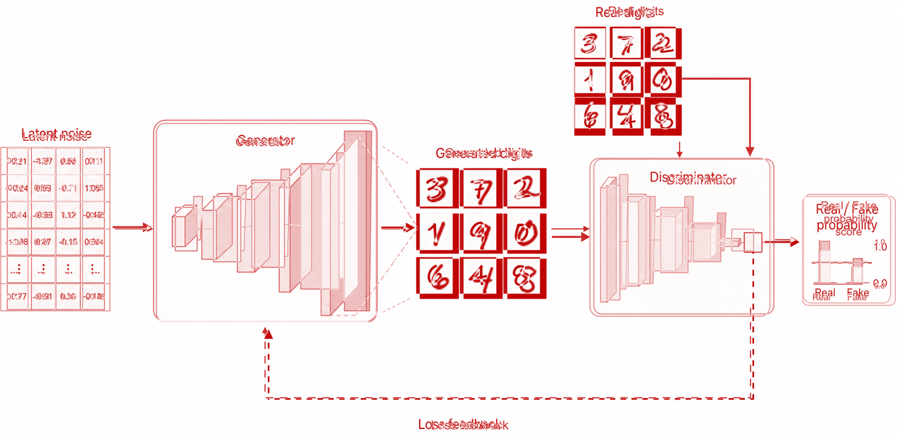

Foreground overlap audit:

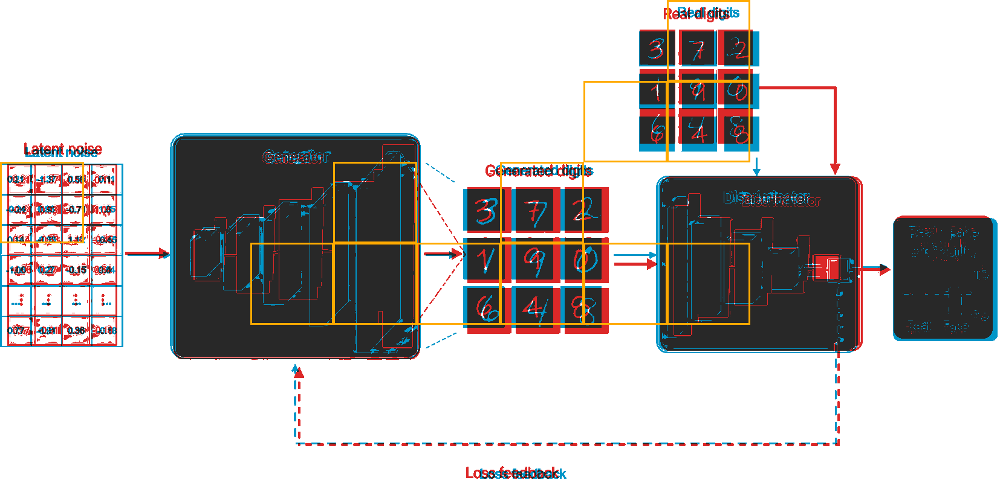

Final artifacts:

- Editable source:
  `example/gan-handwritten-digits/gan-handwritten-digits.drawio`
- PNG preview:
  `example/gan-handwritten-digits/exports/gan-handwritten-digits.png`
- SVG preview:
  `example/gan-handwritten-digits/exports/gan-handwritten-digits.svg`
- Trace notes:
  `example/gan-handwritten-digits/trace-notes.md`
- Strict comparison report:
  `example/gan-handwritten-digits/comparison-final/comparison-report.json`

Final strict-comparison status is `not passed`: the worst remaining mismatch is
the `Real digits` region, and the final strict metrics are `mae=17.6241`,
`ssim=0.7582`, `foreground_iou=0.7678`, `edge_iou=0.0764`, and
`worst_tile_mae=105.0931`. The example keeps those QA artifacts visible so the
remaining mismatch can be inspected rather than treated as a completed pixel
match.

## More Examples

| Prompt | GPT-generated image | Pixel-difference heatmap | draw.io output |
|---|---|---|---|
| 使用$research-draw 帮我绘制一个使用GAN进行手写数字生成的图，科研风格 |  |  |  |
| 使用$research-draw 帮我绘制一个使用ResNet进行猫狗图像分类的图，科研风格 | 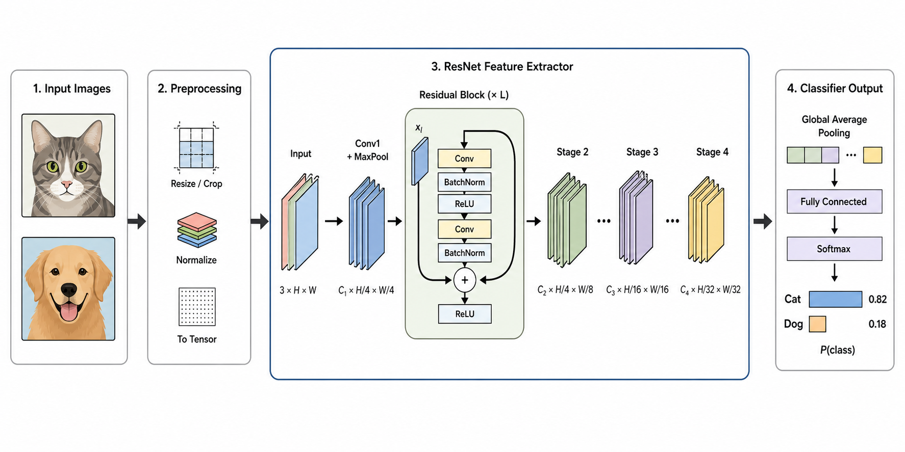 | 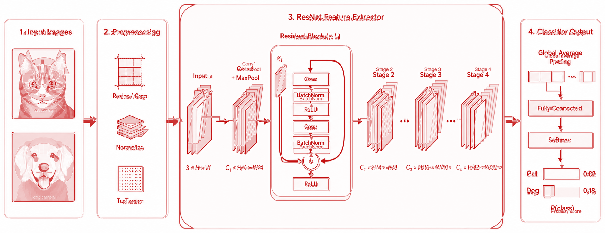 | 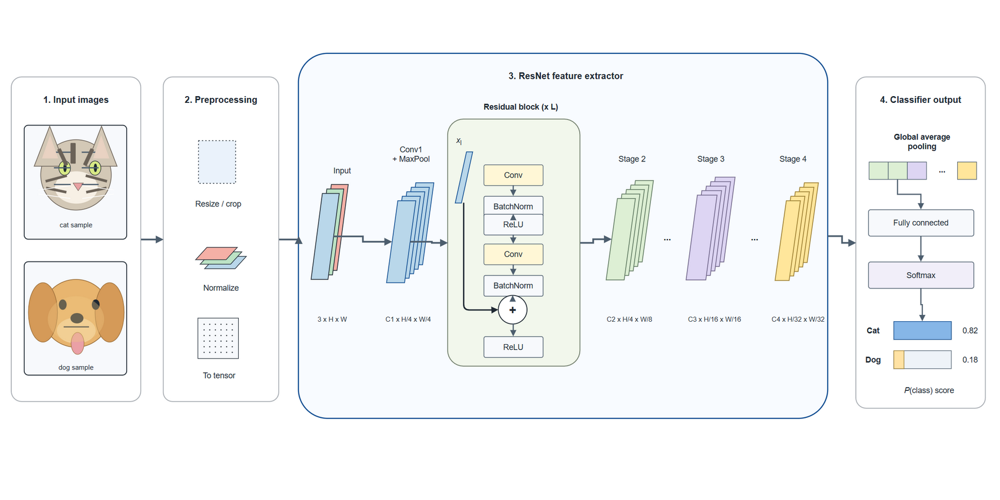 |
| 使用$research-draw 帮我绘制一个使用Transformer进行机器翻译的图，科研风格 | 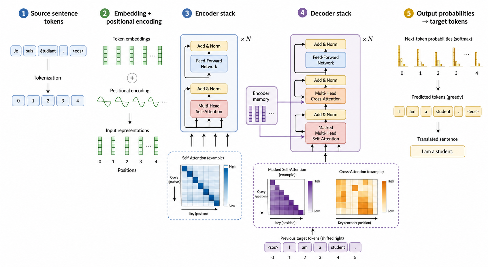 | 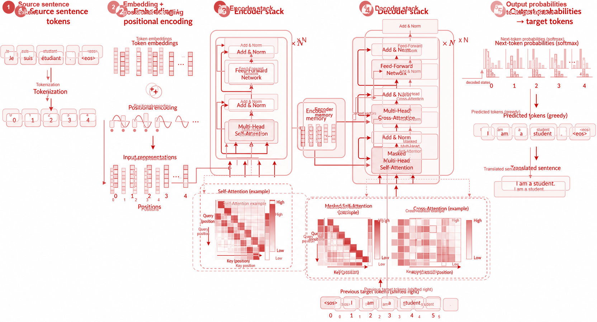 | 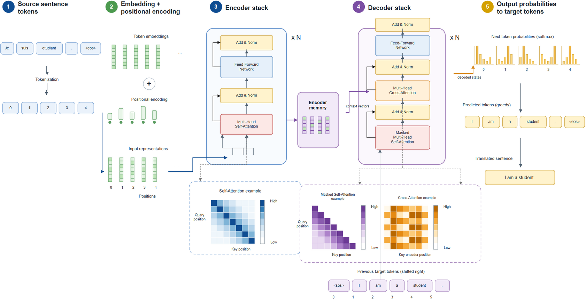 |
| 使用$research-draw 帮我绘制一个使用U-Net进行医学图像分割的图，科研风格 | 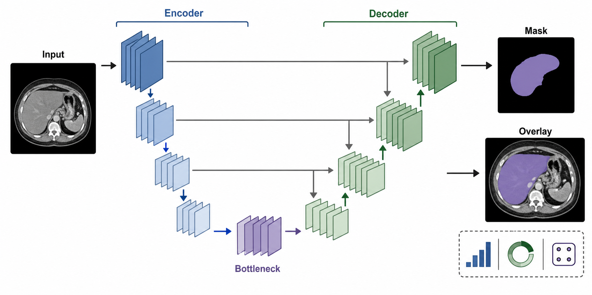 | 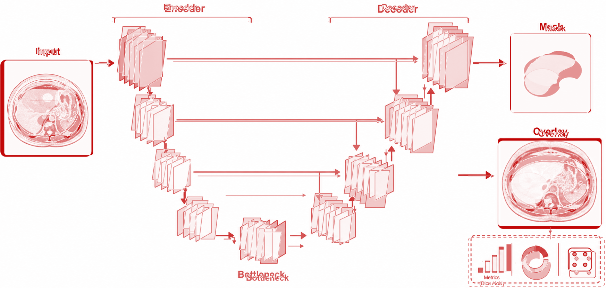 | 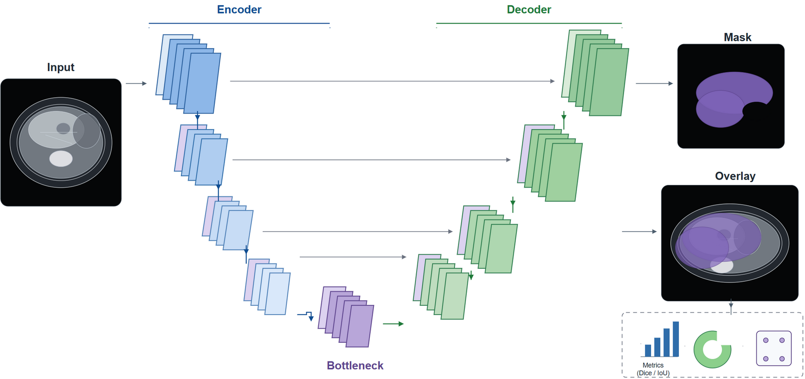 |
| 使用$research-draw 帮我绘制一个使用多组学数据整合进行疾病分型的图，科研风格 | 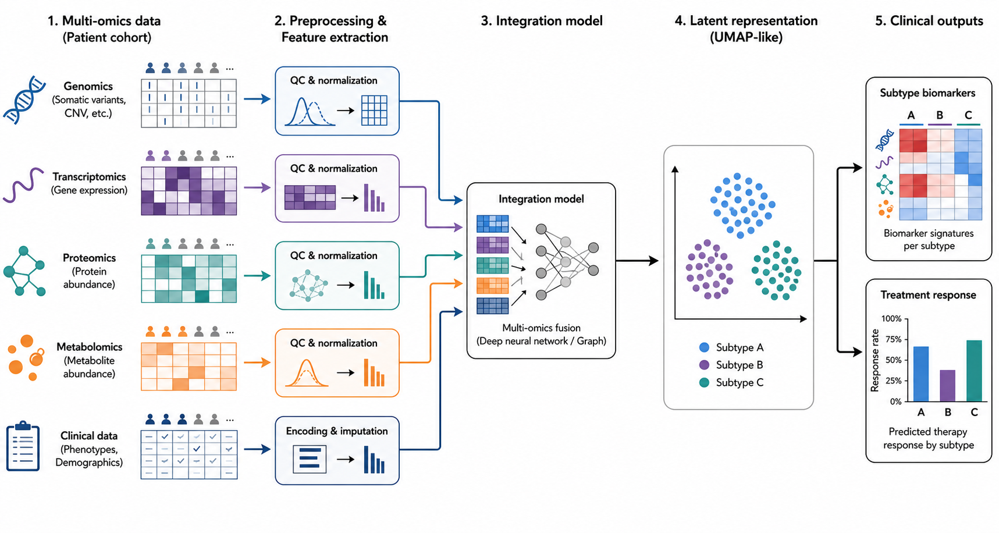 | 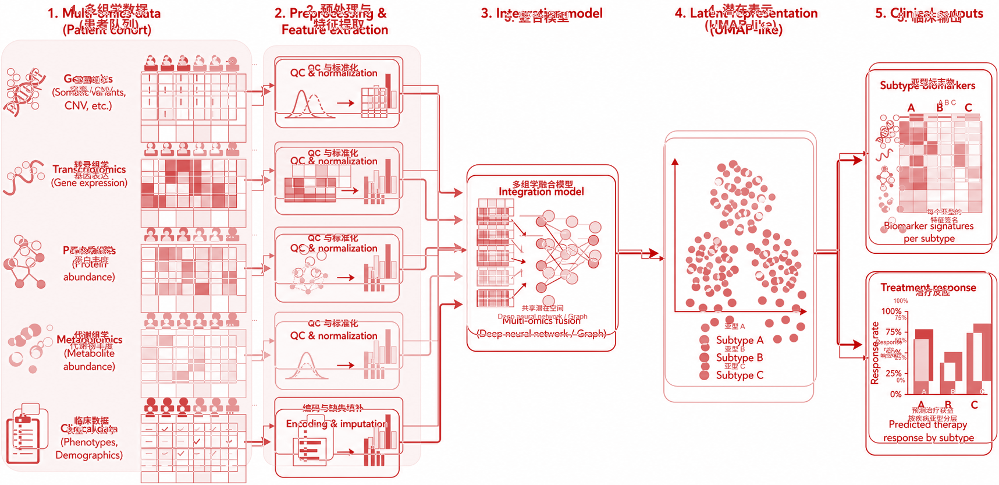 | 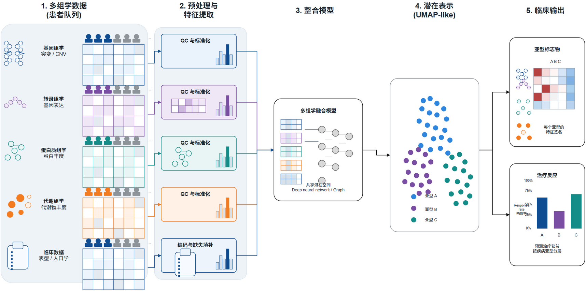 |

## Installation

Copy the skill folders you want into your Codex skills directory. For the full
workflow, install all three:

```powershell
Copy-Item -Recurse -Force `
  "skills\research-draw" `
  "$env:USERPROFILE\.codex\skills\research-draw"

Copy-Item -Recurse -Force `
  "skills\research-drawio-skill" `
  "$env:USERPROFILE\.codex\skills\research-drawio-skill"

Copy-Item -Recurse -Force `
  "skills\add-svg" `
  "$env:USERPROFILE\.codex\skills\add-svg"
```

On macOS or Linux:

```bash
mkdir -p ~/.codex/skills
cp -R skills/{research-draw,research-drawio-skill,add-svg} ~/.codex/skills/
```

## Design Philosophy

This skill treats a research flowchart as a visual argument rather than a
decorative process map.

Every diagram starts with:

1. A one-sentence scientific message.
2. A diagram role, such as method overview, experimental workflow, cohort flow,
   mechanism schematic, analytical pipeline, model architecture, or graphical
   abstract.
3. A topology map of nodes, modules, branches, loops, inputs, and outputs.
4. A grid layout plan with aligned rows, columns, gutters, and connector
   corridors.
5. A composite-element plan that decides which scientific entities should be
   grouped visual glyphs rather than plain text boxes.
6. A math-label contract for formulas and symbols that need draw.io
   mathematical typesetting.
7. A visual vocabulary that maps colors, shapes, labels, and arrows to
   scientific meaning.
8. An export and reviewer-risk contract for journal-ready delivery.

## Skill Contents

`research-draw`:

- `SKILL.md`: main trigger metadata and routing protocol for the two-stage
  generate-then-trace workflow.
- `agents/openai.yaml`: UI metadata and default prompt for invoking the skill.
- `references/two-stage-workflow.md`: stage contract for reference generation,
  draw.io tracing, and completion criteria.
- `references/imagegen-reference-stage.md`: prompt and inspection rules for
  generating a clean scientific reference image.
- `references/png-layout-extraction.md`: geometry extraction rules for tracing
  an existing raster figure.
- `references/drawio-tracing-stage.md`: conversion rules from raster reference
  to editable draw.io modules, glyphs, labels, formulas, and connectors.
- `references/complex-asset-sourcing.md`: policy for online SVG/vector assets
  or self-designed fallbacks for complex recognizable objects.
- `references/consistency-loop.md`: iterative export, strict comparison, and
  repair loop before delivery.

`research-drawio-skill`:

- `SKILL.md`: main trigger metadata and routing protocol.
- `manifest.yaml`: declares always-loaded core files and on-demand references.
- `static/core/contract.md`: required flowchart contract before drawing.
- `static/core/stance.md`: default scientific diagram stance and privacy rule.
- `references/archetypes.md`: scientific flowchart archetypes and anti-patterns.
- `references/composite-elements.md`: editable glyph recipes for bar-chart
  miniatures, DNA/RNA chains, matrices, neural networks, cells, samples, and
  other scientific objects, with rules against decorative charts and label
  overlap.
- `references/layout-and-routing.md`: grid alignment, connector corridors, edge
  labels, collision avoidance, and minimum-bend routing rules.
- `references/math-typesetting.md`: MathJax / draw.io formula handling.
- `references/style-guide.md`: typography, color, shape, connector, and draw.io
  style presets.
- `references/drawio-authoring.md`: `.drawio` / mxGraph XML authoring guidance.
- `references/export-preview.md`: draw.io Desktop CLI export and preview QA.
- `references/strict-visual-comparison.md`: quantitative comparison between a
  raster/GPT/imagegen reference and exported draw.io PNG.
- `references/qa-contract.md`: logic, visual, source-file, and export QA checks.
- `scripts/qa_drawio.py`: lightweight uncompressed/compressed draw.io XML, math,
  alignment, endpoint, text/glyph overlap, label-length, canvas-bound,
  chart-glyph semantics, bend-count, and connector-through-node QA.
- `scripts/export_drawio_preview.py`: exports PNG/SVG/PDF previews through the
  local diagrams.net/draw.io Desktop CLI and probes the output.
- `scripts/compare_drawio_reference.py`: compares a draw.io PNG export against a
  raster reference and writes metrics, mismatch tiles, and visual overlays.

`add-svg`:

- `SKILL.md`: source-gated routing protocol for adding SVG assets.
- `manifest.yaml`: declares the mandatory source gate and mode-specific
  references.
- `static/core/contract.md`: SVG addition contract, including scientific role,
  integration targets, provenance, fallback, and QA notes.
- `static/core/stance.md`: Nature-style stance for restrained, meaningful SVG
  additions.
- `references/network-svg-search.md`: procedure for collecting multiple online
  SVG candidates with source and license notes.
- `references/self-design-svg.md`: rules for original SVG glyphs built from
  simple vector primitives.
- `references/drawio-svg-integration.md`: draw.io image-cell, data URI, label,
  placement, and storage guidance.
- `references/svg-qa-contract.md`: source, visual, draw.io, and delivery QA.
- `scripts/svg_data_uri.py`: converts a local SVG file into a draw.io-compatible
  data URI or image style fragment.

## Validation

If you have the Codex `skill-creator` validation script available, run:

```powershell
$env:PYTHONUTF8 = "1"
python "$env:USERPROFILE\.codex\skills\.system\skill-creator\scripts\quick_validate.py" `
  "skills\research-draw"

python "$env:USERPROFILE\.codex\skills\.system\skill-creator\scripts\quick_validate.py" `
  "skills\research-drawio-skill"

python "$env:USERPROFILE\.codex\skills\.system\skill-creator\scripts\quick_validate.py" `
  "skills\add-svg"
```

Expected result:

```text
Skill is valid!
```

`PYTHONUTF8=1` is recommended on Windows because the skill metadata includes
Chinese trigger phrases.

To inspect a generated `.drawio` file:

```powershell
python "skills\research-drawio-skill\scripts\qa_drawio.py" `
  "example\gan-handwritten-digits\gan-handwritten-digits.drawio"
```

```powershell
python "skills\research-drawio-skill\scripts\export_drawio_preview.py" `
  "example\gan-handwritten-digits\gan-handwritten-digits.drawio" `
  --formats png svg
```

```powershell
python "skills\research-drawio-skill\scripts\compare_drawio_reference.py" `
  "assets\reference-images\gan-handwritten-digits-reference.png" `
  "example\gan-handwritten-digits\exports\gan-handwritten-digits.png" `
  --mode strict `
  --regions-json "example\gan-handwritten-digits\regions.json" `
  --out-dir "example\gan-handwritten-digits\comparison-final"
```

Warnings and strict comparison failures should be reviewed before using a
diagram as a polished example or publication-facing export.
